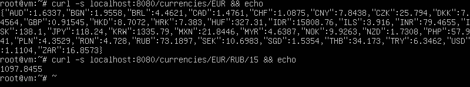

# gocurrencies
api для получения текущих курсов валют

## Install
Для запуска вы можете использовать подготовленный docker контейнер, указав через переменную окружения URL для получения курсов валют, либо использовать значение по умолчанию, представленное в `Dockerfile`. Например:
* `docker run -d -p 8080:8080 --name gocur alexdyukov/gocurrencies` или
* `docker run -d -p 8080:8080 --name gocur -e REMOTE_SVC_URL="https://api.ratesapi.io/api/latest" alexdyukov/gocurrencies`

## REST API
Сервис поддерживает следующие методы:
* `GET /currencies/<base>` - получить информацию о всех доступных валютах и их курсах по отношению к валюте `<base>`
* `GET /currencies/<base>/<target>` - получить информацию о курсе валюты `<target>` по отношению к `<base>`
* `GET /currencies/<base>/<target>/<sum>` - произвести расчёт стоимости валюты в `<target>` по отношению к `<base>` в объёме `<sum>`

## ATTENTION
Обратите внимание, что сервис не поддерживает данные по возможному делению валюты. Данное ограничение оставлено для упращения архитектуры.

**Что имеется в виду**: если 1₽ состоит из 100 копеек, то для покупки 15€ понадобиться 1097.85₽ , т.е. 1097 рубля и 85 копеек, а не как возвращает утилита: 1097.8455 .
Не все валюты(но большинство) имеют деление в сотых долях. Например один тунисский динар (TND) равен 1000 миллимам. Получать информацию по возможному делению валюты выходит за рамки первоначальной задачи, а хардкодить кол-во символов после запятой для каждой валюты не тру.

